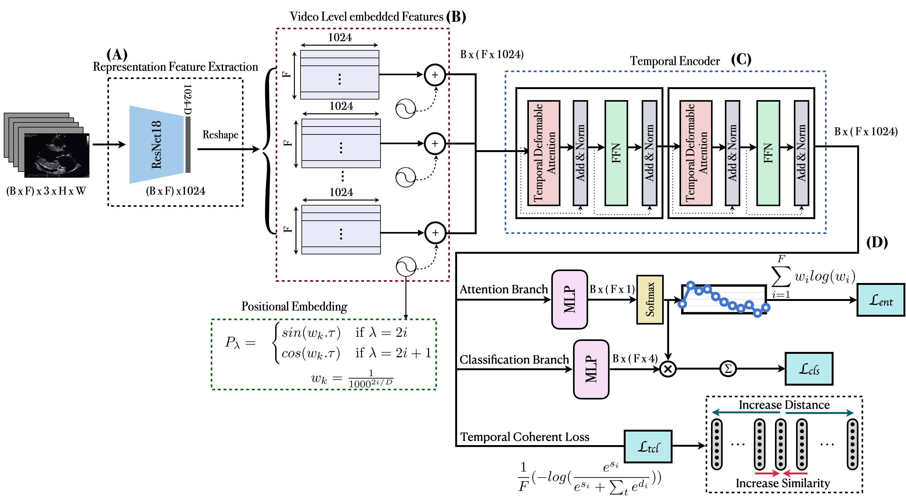
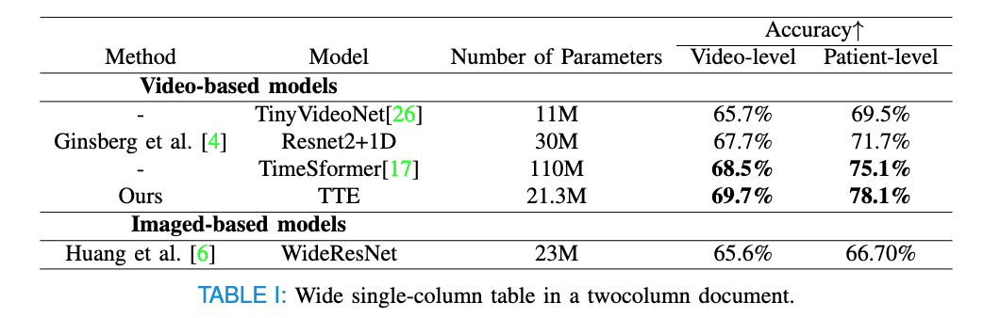

# FTC
This repo holds the code for TadTR, described in the technical report:
[Transformer-based Spatio-temporal Analysis for
Automatic Classification of Aortic Stenosis
Severity from B-mode Ultrasound Cine Series].

## Introduction

 - We introduce an end-to-end spatiotemporal model with an efficient frame-level encoding that can learn small motions by leveraging from temporal deformable attention in its transformer architecture and adopts temporal coherence loss to enforce detecting small spatial changes across frames.
 - We introduce an attention layer to aggregate the disease severity likelihoods over a sequence of frames to produce a cine series-level prediction. These attention weights leverage temporal localization to find the most relevant frames in each cine series. We show that high attention weights consistently correlate with informative frames in each cine series.
 -  We demonstrate state-of-the-art performance on clinical AS datasets, improving upon previous models for AS severity classification while having considerably less parameters compared to other video analysis models such as ResNet2+1D and TimesFormer.



## Sections
The main folder contains the code implemented for the private dataset. 

## TODOs


## Main Results



## Install
### Requirements

* Linux or Windows
  
* Python>=3.7

* (Optional) CUDA>=9.2, GCC>=5.4
  
* PyTorch>=1.5.1, torchvision>=0.6.1 (following instructions [here](https://pytorch.org/))
  
* Other requirements
    ```bash
    pip install -r requirements.txt
    ```
### Running the Code
In order to run the model add your own dataloader in dataloader folder. Chnage the path to dataloader in train.py and run the code below
`opts.py`.
```bash
python train.py 
```


## Acknowledgement
The code is includes borrowed implementations from (https://github.com/xlliu7/TadTR) and (https://github.com/HReynaud/UVT). Thanks for their great works.

## Citing
```
Will be added
```

## Contact

For questions and suggestions, please contact Neda Ahmadi via nedaahmadi77@gmail.com.
