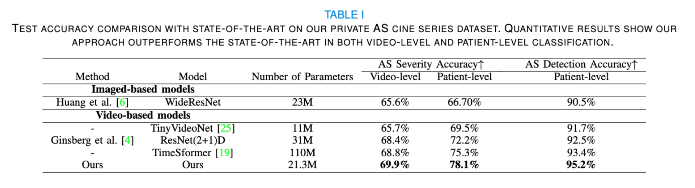

# FTC
This repo holds the code for TadTR, described in the technical report:
[Transformer-based Spatio-temporal Analysis for
Automatic Classification of Aortic Stenosis
Severity from B-mode Ultrasound Cine Series].

## Introduction

 - We introduce an end-to-end spatiotemporal model with an efficient frame-level encoding that can learn small motions by leveraging from temporal deformable attention in its transformer architecture and adopts temporal coherence loss to enforce detecting small spatial changes across frames.
 - We introduce an attention layer to aggregate the disease severity likelihoods over a sequence of frames to produce a cine series-level prediction. These attention weights leverage temporal localization to find the most relevant frames in each cine series. We show that high attention weights consistently correlate with informative frames in each cine series.
 -  We demonstrate state-of-the-art performance on clinical AS datasets, improving upon previous models for AS severity classification while having considerably less parameters compared to other video analysis models such as ResNet2+1D and TimesFormer.


## Sections
The main folder contains the code implemented for the private dataset. Implementation for TMED2 dataset is available in folder named tuft. You can get access to TMED2 dataset at https://tmed.cs.tufts.edu/tmed_v2.html. 
### Dataloader
You can add your own dataloader or adjust the implementation of dataloader/as_dataloader.py. Make sure to import your dataloader in train.py.
### Model
The defined models are available in folder named model. The implementation of final model mentioned in the paper is in model/FTC_TAD. There also more choices for model selection and you can choose the model you desire by changing the name of model in get_config.py and add that model in get_model.py.
### Wandb
If you want to enable the wandb log place config['wandb']= True in get_config.py and replace your directory and project name accordingly in train.py.
### Config
All hyperparamteres can be adjusted in get_config.py.
### Training Scheme
The training procedures, loss functions and ... are implemented in network.py.
### Visualization
You can find implementations for different visualizations such as t-SNE, confusion matrix, uncertainty estimation and ... in visualization/vis.py

## Main Results



## Install
### Requirements

* Linux or Windows
  
* Python>=3.7

* (Optional) CUDA>=9.2, GCC>=5.4
  
* PyTorch>=1.5.1, torchvision>=0.6.1 (following instructions [here](https://pytorch.org/))
  
* Other requirements
    ```bash
    pip install -r requirements.txt
    ```
### Running the Code
In order to run the model add your own dataloader in dataloader folder. Chnage the path to dataloader in train.py and run the code below
`opts.py`.
```bash
python train.py 
```


## Acknowledgement
The code is includes borrowed implementations from (https://github.com/xlliu7/TadTR) and (https://github.com/HReynaud/UVT). Thanks for their great works.

## Citing
```
Will be added
```

## Contact

For questions and suggestions, please contact Neda Ahmadi via nedaahmadi77@gmail.com.
